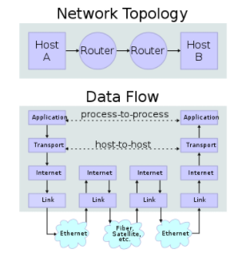

# Introducción al stack TCP/IP

## ¿Cual es la funcion de las redes?
La idea es interconectar dos hosts, uno que está en un lado del mundo y otro del otro lado, con total abstracción de lo que pasa adentro.

Un host puede ser una computadora, un celular, cualquier dispositivo que tenga una dirección IP.

Para redirigir a los hosts vamos a utilizar routers, que tienen la capacidad de conectar estas redes, son dispositivos de capa 3. La idea de las redes es que la comunicacion entre las "nubes" de dispositivos sea estándar para todos los elementos de la red

El router es un elemento de red que nos permite interconectar redes TCP/IP. Utilizan la dirección de red de destino para direccionar los paquetes, no la del host. El router puede no saber la direccion del host, solo quiere saber en que red está conectado el host, el router decide a través de qué camino enviar el paquete a través de las tablas de ruteo que tiene implementadas. 

## Arquitectura en capas

Analogía aeropuerto, la serie de acciones que hacemos a la ida, es la misma que hacemos a la vuelta pero en sentido inverso.
Cada capa tiene una resposabilidad para brindarle a la otra

### Capa 1 : Capa física
- los protocolos para la comunicacion por aire son los que me definen cómo transformo la información para enviar los bits a través de este medio
- comunicacion por cable o UTP, mas rapida
- comunicacion por fibra, la luz transporta mas rapido todavía.

### Capa 2: Capa de enlace 
La capa de enlace tiene la responsabilidad de tomar esos bits y convertirlos en un frame, en una primer porción de software que utilizará el host. Transforma lo que es fisico a lógico.

### Capa 3: Capa de red
en base a direcciones redirigen el trafico

### Capa 4: Capa de transporte
se encarga de administrar flujos de tráfico y es una interfaz entre la capa de red y la capa de aplicación 

### Capa 5: Capa de aplicación
x ejemplo, levantar una api. está destinada a procesos.

Pueden haber distintos protocolos, pero siempre y cuando respeten su funcion según la capa a la que pertenecen.

 

Mi host va a bajar las cosas a la capa de trasnsporte, va a darles una direccion ip a mis paquetes y a traves de la capa de enlace lo va a pasar a la capa fisica, en este caso ethernet. Mi router va a levantar los paquetes, lee la direccion, toma una decisión y los devuelve a la red. En este punto probablemente los paquetes ya pasen a un medio fisico mas rapido como fibra optica.

Supongamos que el 2do router corresponde a un router de reborde de Google, el cual va a leer la dirección IP y va a decir, por ejemplo "okay este paquete está destinado al server 183" y lo envia nuevamente a través de un medio cableado al servidor correspondiente, que va a subir a través de todas las capas y va llegar a los datos.

Los routers no tiene que abrir la capa hasta la capa de aplicación.

### Encapsulamiento de paquetes

- Capa 5(aplicación) -> [mensaje] "hola google!"

El proceso tiene reservado un puerto, sabe por ejemplo que para un paquete de datos http tiene que ir al puerto 80.
Como se comunican la capa de red con los procesos, esa información la sabe la capa de transporte. 

- Capa 4(transporte) -> [Header transporte] "che voy a usar el protocolo de capa de transporte tal, con el puerto que estoy usando"
- Capa 3(red) -> le agrega un header con la direccion origen y destino de la capa de red
- Capa 2(enlace) -> le agrega un header y una cola para saber si la información es correcta

Cuando recibimos un mensaje, hay que realizar el proceso inverso:

Cuando recibo los bits con la trama, el primer header (capa de enlace) me avisa que protocolo estoy usando, entonces va a saber que el header que sigue tiene la forma de, por ejemplo, IPv4. Con el header que sigue pasa lo mismo, me avisa que el header que sigue utiliza protocolo TCP, y así.

 ## ¿Qué es un sniffer de red?

 Es un analizador de paquetes que nos permite inspeccionar tanto las cabeceras como el contenido de los mensajes.

 
