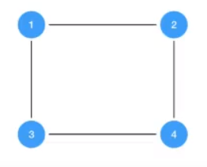

# Capa de enlace STP

seguimos en la capa de enlace

## ¿Como funciona un switch?
PC1 tiene un mensaje para PC3, ya conoce su MAC. PC1 se lo manda al Switch 1, que en primera instancia carga la MAC de PC1 en su tabla. Ahora, como no conoce la MAC de PC3, inunda los puertos. PC2 recibe el mensaje, reconoce que no es su MAC y devuelve el paquete. El Switch1 entonces inunda el puerto 3. De ahí lo recibe el Switch2. Carga la MAC de PC1 porque es el que envió el paquete, e inunda el puerto 2 por descarte. Ahora llega al Switch3, e inunda los puertos, PC3 responde, carga entonces el Switch3 la MAC de PC3 y también la MAC de PC1 porque es el que envió el mensaje. El Switch3 no tiene que inundar para el mensaje de retorno porque ya lo conoce.

**todas las PC reciben Y ACEPTAN un mensaje broadcast**

broadcast nos trae problemas en la capa 3

## Tormentas de broadcast

## STP - Spanning Tree Protocol

se monta sobre el protocolo ethernet IEEE 802.3

es de la capa 2, por ende cuando utilicemos el protocolo Ethernet IEEE802.3, este en el tipo va a avisar que es un protocolo STP, y para qué sirve STP? para ponerse de acuerdo entre los switches. lleva información de una trama de mas arriba. No hay nada encapsulado en STP. STP está encapsulado en capa 2 y nada más 

STP funciona con grafos
1) Supongmamos la siguente topología, representada como un grafo, donde los numeros de los vertices son los ID de los switches (los ID son únicos)

2) Inicialmente, todos los SW se consideran a sí mismos _root_. Intercambian mensajes llamados BPDU, dondeadvierten su ID a sus vecinos. Será elegido como _root_ el SW con menor ID.

_el switch 3 se considera root, le dice a su vecino el switch4 che soy root, pero el switch4 le dice yo tambien soy root, entonces se fijan en su ID y como el de sw3 es menor, definen a sw3 como root. ahora sw3 habla con sw1 y pasa lo mismo, como se da cuenta que sw1 es root, sw3 le avisa a sw4 que sw1 es root y se van actualizando_

3) Cada uno de los switches no root, va a tener un solo camino posible hacia el root a través de un puerto llamado root-port. El otro camino se va a bloquear lógicamente 

La idea es siempre tener un arbol  

_¿Porqué armamos topologías cíclicas?_ por redundancia. Si un enlace fisico se cae, aun tenemos enlaces logicos para salvar la conexión

