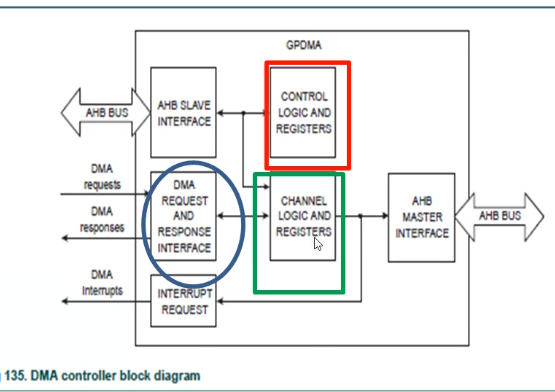

# DMA
**aka direct memory access** 

Para aquellos bloques que necesitan acceso directo a memoria, sin pasar por el procesador. El procesador no está diseñado para hacer de pasamanos de datos, sino para procesar datos y hacer algo con ellos. A travésd el controlador DMA podemos hacer transferencias de memoria a memoria, de memoria a periferico, o periferico a periferico. No procesa datos sino hace **traspaso de datos**.

Todo está mapeado como lugar de memoria, los periféricos también. 

Estas transferencias van a estar sincronizadas por algun evento que puede ser seleccionado de la lista de eventos, ejemplo, durante un wait del microcontrolador.

Reduce la latencia, nos ahorra tiempo de procesador, no tieen que estar pendiente de las operaciones que llevara a cabo el DMA. Se pueden realizar operaciones sumultaneamente, convirtiendo el microcontrolador de un unico nucleo en un dispositivo multitarea. Esas tarea son "multinucleo"

el DMA puede llegar a interrumpir al micro cuando ocurren errores.

como programar al periferico para que haga un requerimiento al DMA. 

En principio el core tiene comunicacion con el DMA solamente para programarlo, pero de ahi en adelante el DMA tiene un módulo maestro. interfaz esclava para que el core lo pueda programar, interfaz maestra que se va a encargar de la comunicacion con cualquier periférico

- 8 canales DMA, transferencia unidireccional 
- 16 lineas de solicitud de DMA, en el  modulo hay un arbitro, las solicitudes tienen prioridades tmb
- permite los periféricos en naranjita, las transferencias hacia o desde GPIO tambien son compatibles. puedo sacar un banco de datos del puerto sin que el core se entere
- listas vinculadas, "levantenme de tal zona a tal zona 1000 datos". Las areas de origen y destino no tienen que ocupar areas continuas de memoria
- prioridad de canal de hardware DMA
- ancho de bus maestro AHB 32 bits
- transmisioin en ráfaga programable, toma dato, transmite, y así, o transmisión de un solo dato
- admite transacciones de 8, 16 y 32 bits de ancho
- se puede generar una interrupcion en el procesador al finalizar un DMA o cuando un erro ha ocurrido
- estado de error sin procesar. el error DMA y el estado de interr sin procesar del recuento DMA se pueden leer antes del enmascaramiento. 
- DMA soporta big endian y little endian -> qué formato tiene el dato que va a trasnmitir
- FIFO interna de cuatro palabras por canal

little endian -> el byte de menor peso está en la parte mas baja de la dirección

big endian -> el byte mas grande está en la dirección mas baja

_endian behavior_ -> tabla 542

rojo -> el core recibe la programacion del core y va directo al control and logic registers, no puede generar comunicacion desde el slave

azul -> el monitor que gestiona las request

## Canales lógicos y sus registros

cargo un buffer muy chiquito (4 palabras) pero es para tratar de que los waits no sean tan largos. 

no puedo cambiar las prioridades, están refinidas por hardware. el canal 0 es el de mayor prioridad.

### Señales de solicitud DMA

- CB -> señales de solicitud de ráfaga. provocan una rafaga programadad e datos a transferir **burst request**
- CS -> señales de solicitud de transferencia única **single request**
- CLB -> ultimas señales de solicitud de rafaga **last burst request**
- CLS -> ultima señal de solicitud de transferencia unica **last single request**

### Señales de respuesta DMA

nos avisa si se ha completado la solicitud realizada

DMACCLR -> DMA channel clear, limpia la bandera

DMACTC -> es de conteo, señal de recuento, puede utilizarse para indicarle al periferico que la transferencia está completa

